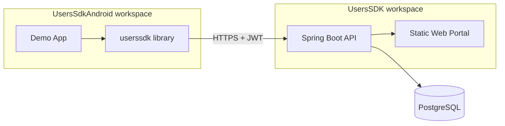
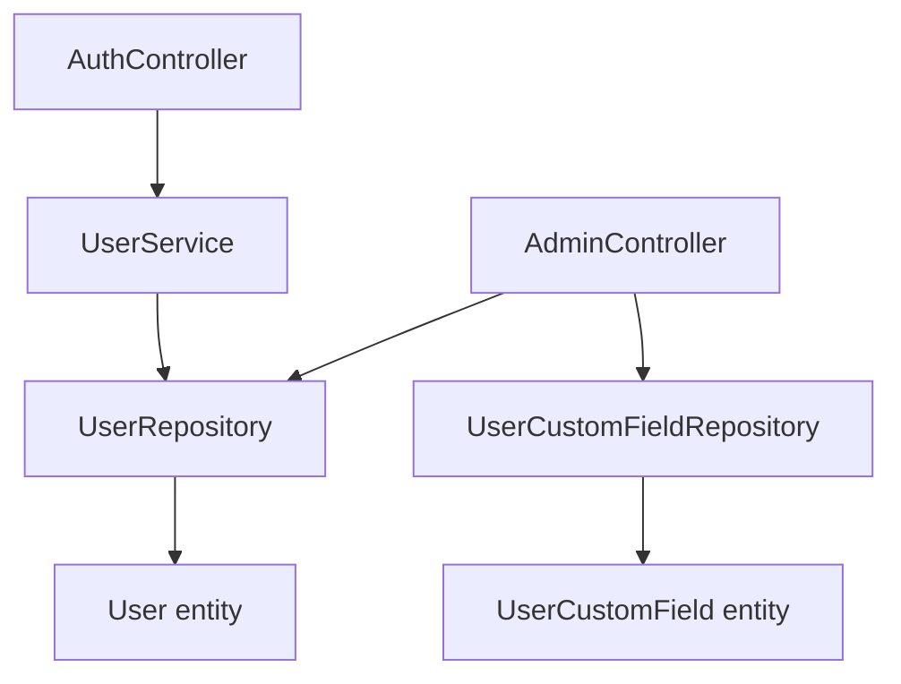
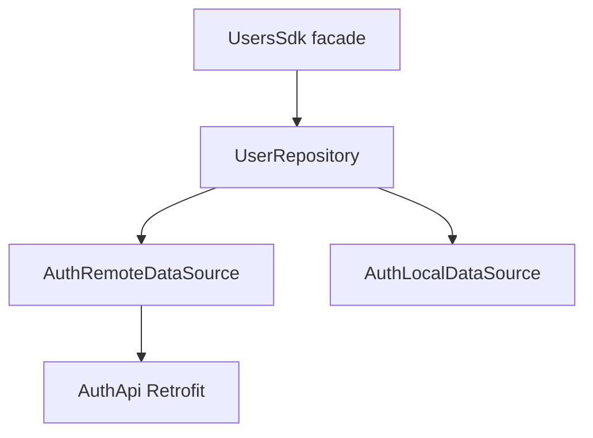

# UsersSDK – Architecture and Modules

This document describes the full architecture and every module of the UsersSDK ecosystem. The codebase spans **two workspaces**: **UsersSDK** (backend and static web frontend) and **UsersSdkAndroid** (Android SDK library and demo app).

---

## High-level overview

The system consists of two main projects. **UsersSDK** is a Spring Boot backend that provides user and authentication management with an admin–user hierarchy, custom fields per user, and JWT-based stateless auth; it also serves a static Admin Portal. **UsersSdkAndroid** is an Android project containing a **userssdk** library module and a demo **app** module. The library is a single facade (UsersSdk) for Android apps to register, login, manage users, and work with appointments stored as custom fields on the backend. The backend has no dedicated appointment entity: appointments are stored as a `UserCustomField` with name `"Appointment"` and a semicolon-separated list of `"yyyy-MM-dd HH:mm"` values. The Android SDK talks to the backend over HTTP using Retrofit and attaches the JWT from local storage to authenticated requests.

---

## Architecture diagrams

### System context

### Backend layers

### Android SDK layers

---

## Backend (UsersSDK)

- **Tech stack**: Spring Boot 3.5, Java 21, Spring Security, JWT (jjwt), JPA/Hibernate, PostgreSQL.

### Entry point

- **`src/main/java/com/example/userssdk/UsersSdkApplication.java`** – Standard `@SpringBootApplication` entry; runs the web app and security stack.

### Config (`config/`)

- **SecurityConfig** – Configures stateless JWT auth, CORS, BCrypt password encoder, and `SecurityFilterChain`. Public routes: `/api/auth/**`, static assets, `/api/auth/my-users`, `PUT /api/auth/users/**`. All other requests require authentication. Registers `JwtFilter` before `UsernamePasswordAuthenticationFilter`.
- **JwtFilter** – `OncePerRequestFilter` that reads `Authorization: Bearer <token>`, validates via `JwtUtil`, loads `User` from `UserRepository`, and sets `SecurityContext` with `ROLE_USER` or `ROLE_ADMIN`.
- **JwtUtil** – Generates and validates JWT (subject = email, claim role). Uses HMAC key from `app.jwt.secret`; expiration 24 hours.

### Entities (`entities/`)

- **User** – `id`, `name`, `email`, `password`, `role` (enum), `admin` (ManyToOne to User), `customFields` (OneToMany to UserCustomField). Table `users`.
- **Role** – Enum: `USER`, `ADMIN`.
- **UserCustomField** – `id`, `fieldName`, `fieldValue`, `user` (ManyToOne). Table `user_custom_fields`. Appointments use `fieldName = "Appointment"` and `fieldValue` as semicolon-separated `"yyyy-MM-dd HH:mm"` strings.

### DTOs (`dto/`)

- **AuthResponse** – Token + UserDTO (returned on login/register).
- **LoginRequest** – Email, password.
- **RegisterRequest** – Name, email, password, role, optional adminId, optional customFields.
- **UserDTO** – id, email, name, role, adminId, customFields (list of CustomFieldDTO).
- **CustomFieldDTO** – fieldName, fieldValue.

### Repositories (`repositories/`)

- **UserRepository** – `JpaRepository<User, Long>`. Methods: `findByEmail(String)`, `findByAdminId(Long)`.
- **UserCustomFieldRepository** – Used by AdminController for CRUD on custom fields (e.g. `findByUserId`, `deleteById`).

### Service layer (`service/`)

- **UserService** / **UserServiceImpl** – `register(RegisterRequest)` (encodes password, optionally links admin, maps custom fields, saves user, returns JWT + UserDTO), `login(LoginRequest)` (validates credentials, returns JWT + UserDTO), `getAllUsers()`, `getUsersManagedBy(Long adminId)`, `updateUser(Long id, UserDTO)` (updates name, email, replaces custom fields).

### Controllers (`controllers/`)

- **AuthController** – Base path `/api/auth`.
  - `POST /register` – Register; returns AuthResponse.
  - `POST /login` – Login; returns AuthResponse.
  - `GET /all` – All users (no auth enforced in config for some paths; typically for admin listing).
  - `GET /admin/{adminId}/users` – Users managed by given admin.
  - `GET /me` – Current user (principal from JWT).
  - `GET /my-admin` – Admin of current user (or self if current user is admin).
  - `GET /my-users` – Users managed by current principal (admin’s users or same group as user).
  - `PUT /users/{id}` – Update user; allowed if principal is admin or updating self.
- **AdminController** – Base path `/api/admin`.
  - `POST /users/{userId}/fields` – Add custom field to user.
  - `GET /users/{userId}/fields` – List custom fields for user.
  - `DELETE /fields/{fieldId}` – Delete custom field.
  - `PUT /fields/{fieldId}` – Update custom field.

### API summary

| Method | Path | Auth | Purpose |
|--------|------|------|---------|
| POST   | /api/auth/register       | No  | Register |
| POST   | /api/auth/login          | No  | Login |
| GET    | /api/auth/all            | No* | List all users |
| GET    | /api/auth/admin/{id}/users | Yes | Users by admin id |
| GET    | /api/auth/me             | Yes | Current user |
| GET    | /api/auth/my-admin       | Yes | My admin (or self) |
| GET    | /api/auth/my-users       | Yes | Users I manage / my group |
| PUT    | /api/auth/users/{id}     | No* | Update user (controller checks self/admin) |
| POST   | /api/admin/users/{id}/fields | Yes | Add custom field |
| GET    | /api/admin/users/{id}/fields | Yes | Get custom fields |
| PUT    | /api/admin/fields/{id}   | Yes | Update custom field |
| DELETE | /api/admin/fields/{id}   | Yes | Delete custom field |

\* Some auth paths are permitted in SecurityConfig for flexibility; authorization is enforced in controller where needed.

### Security

- Public: `/api/auth/**` (login, register, etc.), static files, `/api/auth/my-users`, `PUT /api/auth/users/**`.
- Authenticated: everything else. Role is set in SecurityContext; controllers enforce “admin or self” for update and “my users” for listing where applicable.

### Data model

- **User – Admin**: ManyToOne (`User.admin` → User). Admins have no admin (null); users point to their admin.
- **User – UserCustomField**: OneToMany (cascade all, orphan removal). Appointments = custom field with name `"Appointment"` and value a semicolon-separated list of `"yyyy-MM-dd HH:mm"` strings.

### Deployment

- **Dockerfile** – Builds the Spring Boot app (e.g. `./gradlew bootJar` and run the jar).
- **docker-compose.yml** – Defines `postgres` (PostgreSQL 16, port 5432) and `app` (backend); app uses `SPRING_DATASOURCE_*` to connect to the postgres service.
- **application.properties** – Datasource URL, username, password, JPA/Hibernate (ddl-auto=update, PostgreSQL dialect), `app.jwt.secret`, server port 8080, bind address 0.0.0.0.

---

## Static web frontend (backend repo)

Served by Spring Boot from `src/main/resources/static/`. No separate build step.

- **index.html** – Admin Portal: register form (name, email, password, role, optional admin ID, dynamic custom fields), login form, “Welcome Admin” section, table of “users you manage”, edit-user section with custom fields.
- **script.js** – Calls backend `/api/auth/login`, `/api/auth/register`, `/api/auth/me`, `/api/auth/my-users`, `/api/auth/users/{id}` (PUT), stores token and uses it for authenticated requests.
- **style.css** – Styles for the portal.

---

## Android SDK library (userssdk module)

**Purpose**: Single facade for Android apps to use backend auth and user management and optional appointments stored in user custom fields.

**Tech**: Java, Retrofit, OkHttp, Gson, SharedPreferences, Kizitonwose Calendar (view library).

### Facade

- **UsersSdk** – Singleton. `init(Context, baseUrl)` creates Retrofit + AuthApi, AuthLocalDataSource, AuthRemoteDataSource, UserRepository. Public API: `register`, `login`, `currentUser`, `myUsers`, `updateUser`, `getToken`, `logout`, `listAdmins`, `getCurrentUser` / `setCurrentUser`. Inner class **Appointments**: `listValues`, `add`, `replace`, `delete` (appointment strings on UserDTO), `hasConflictAgainstMyUsers` (checks candidate slot against myUsers with ConflictDetector).

### Config

- **SdkConfig** – `appointmentMinutes`, `appointmentFieldName`, `locale`, `allowBackToBack`. Set via `UsersSdk.setConfig(...)`.

### Network (`network/`)

- **ServiceGenerator** – Builds Retrofit with OkHttp (HttpLoggingInterceptor + TokenInterceptor), Gson converter; `create(baseUrl, TokenProvider)`.
- **AuthApi** – Retrofit interface: register, login, allUsers, me, myUsers, updateUser (PUT).
- **TokenInterceptor** – OkHttp interceptor; skips adding token for login/register; otherwise adds `Authorization: Bearer <token>` from TokenProvider.

### Datasources (`datasource/`)

- **AuthRemoteDataSource** – Wraps AuthApi calls (register, login, me, myUsers, updateUser).
- **AuthLocalDataSource** – SharedPreferences (`users_sdk_pref`): save/get/clear JWT token.

### Repository

- **UserRepository** – Holds AuthRemoteDataSource and AuthLocalDataSource. Register/login save token on success; `currentUser`, `myUsers`, `updateUser` call remote and pass through; `getToken`/`clearToken` delegate to local.

### Models (`model/`)

- **AuthResponse**, **UserDTO**, **LoginRequest**, **RegisterRequest**, **CustomFieldDTO** – Mirror backend DTOs for JSON (Gson) and in-memory use.

### Appointments (`appointments/`)

- **Appointment** – Immutable: `start` (LocalDateTime), `minutes`; `getEnd()`.
- **AppointmentUtils** – Read/write the `"Appointment"` custom field on UserDTO (semicolon-separated values); `readValues`, `writeValues`, `addValue`, `replaceValue`, `removeValue`, `parse`, `extractAppointments`. Default format `yyyy-MM-dd HH:mm`.
- **ConflictDetector** – Builds an index from a list of UserDTO (appointment strings); `hasConflict(candidate, currentUserId, allowSameUserId)` checks time overlap with configurable slot length.

### UI (embeddable) (`ui/`)

- **UsersSdkCalendar** – Factory: `newUserCalendarFragment()`, `newAdminCalendarFragment()`.
- **UserCalendarFragment** – Calendar view + list of appointment times for the current user (uses SDK currentUser and AppointmentUtils).
- **AdminCalendarFragment** – Calendar + list of slots for “my users” (loads myUsers, aggregates appointments by date).
- **UserProfileFragment** – Shows current user name, email, role, custom fields, appointment count and next appointment (user or admin aggregate).

### Data flow

App → UsersSdk → UserRepository → AuthRemoteDataSource (AuthApi) or AuthLocalDataSource (token). Appointments: same UserDTO custom fields; add/replace/delete go through AppointmentUtils then `updateUser`. Conflict detection: `myUsers` → ConflictDetector index → `hasConflict`.

---

## Demo Android app (app module)

**Purpose**: Sample app that uses the SDK for login, register, admin vs user flows, profile, calendar, and appointments.

### Structure

- **UI** (`ui/`) – **MainActivity**: initializes SDK with base URL, shows Register and Login buttons; **LoginActivity**: login via SDK, navigates to AdminAppointmentsActivity or UserAppointmentsActivity by role; **RegisterActivity**: registration with role/admin selection; **ProfileActivity** / **ProfileFragment**: profile UI; **AdminAppointmentsActivity**, **AdminCalendarActivity**, **UserAppointmentsActivity**: admin and user appointment flows; **AdminUsersAdapter**, **AppointmentRowAdapter**: list adapters.
- **Data** – **AppointmentRepository**: in-memory list of app-level **Appointment** (id, title, time); used only for demo UI and is separate from the SDK’s backend-backed appointments (UserDTO custom fields).

### Dependency

- `implementation(project(":userssdk"))`.

### Flow

MainActivity → Login or Register → after auth, by role → AdminAppointmentsActivity or UserAppointmentsActivity. All auth and backend-backed user/appointment data go through the SDK.

---

## Cross-cutting

### Appointments

The backend has no dedicated appointment entity. Appointments are stored as a **UserCustomField** with `fieldName = "Appointment"` and `fieldValue` a semicolon-separated list of `"yyyy-MM-dd HH:mm"` strings. The SDK’s **AppointmentUtils** and **ConflictDetector** rely on this convention.

### Auth flow

1. Client calls `/api/auth/login` or `/api/auth/register`; backend returns **AuthResponse** (JWT + UserDTO).
2. Android **UserRepository** (on success) saves the token via **AuthLocalDataSource** (SharedPreferences).
3. Subsequent requests: **TokenInterceptor** gets token from repository (via UsersSdk) and adds `Authorization: Bearer <token>`.
4. Backend **JwtFilter** reads the token, **JwtUtil** validates it, **UserRepository** loads User by email, and **SecurityContext** is set with the user and role.

---

## Quick reference

| Item | Value |
|------|--------|
| Backend port | 8080 |
| Backend base package | `com.example.userssdk` |
| Android SDK init | `UsersSdk.init(context, "http://host:8080/")` |
| Auth endpoints | POST `/api/auth/register`, POST `/api/auth/login` |
| Current user | GET `/api/auth/me` |
| My users | GET `/api/auth/my-users` |
| Update user | PUT `/api/auth/users/{id}` |
| Appointments storage | User custom field name `"Appointment"`, value `"yyyy-MM-dd HH:mm; ..."` |
