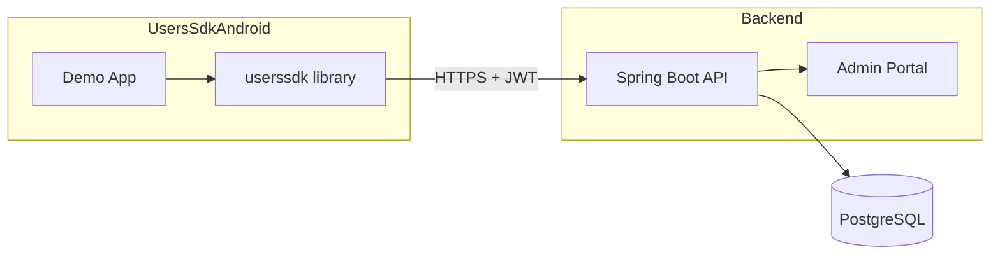
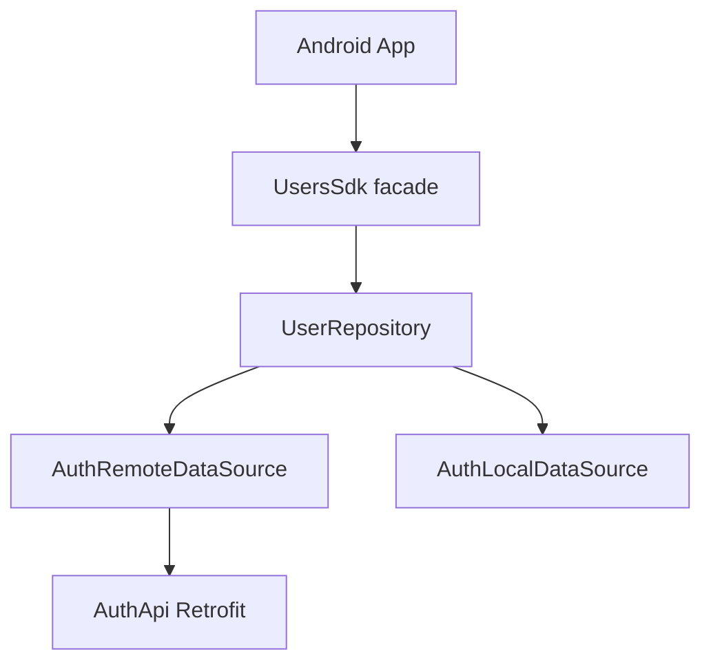
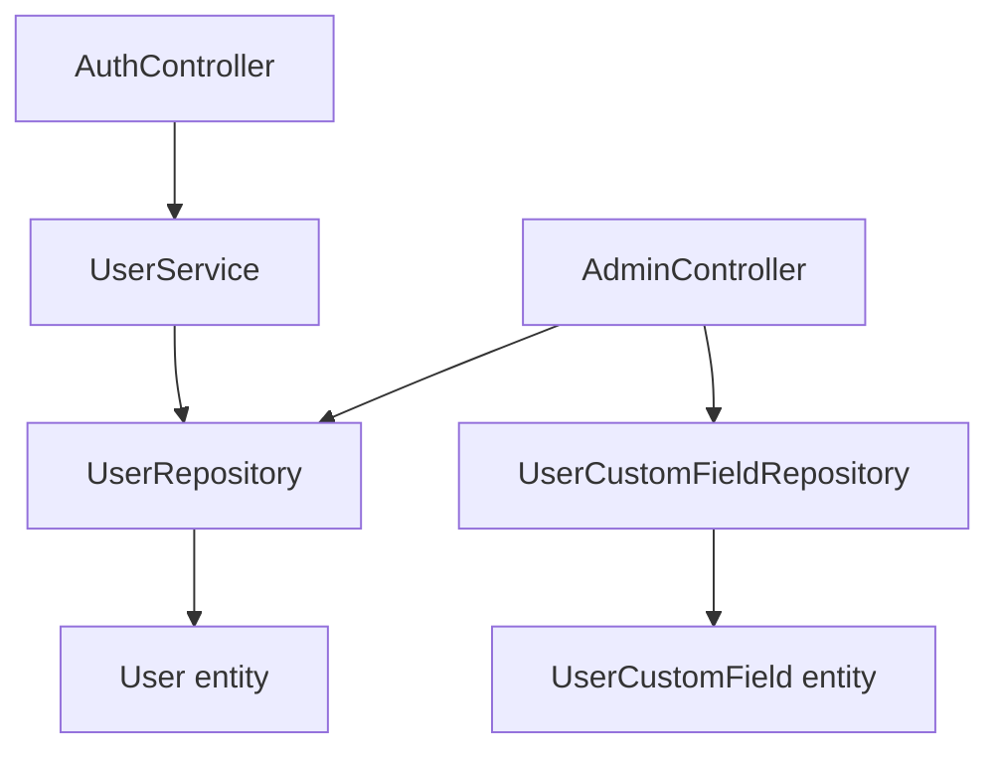
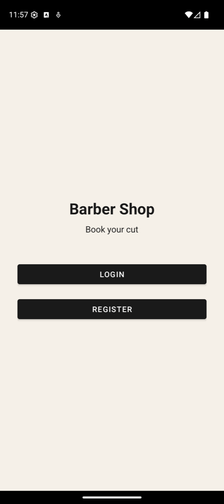
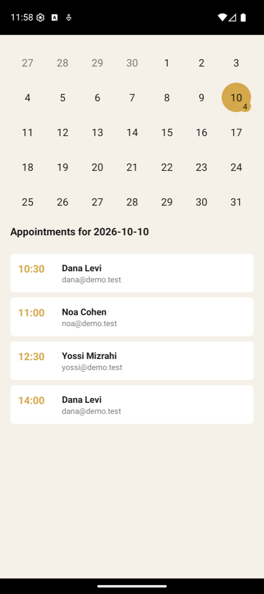
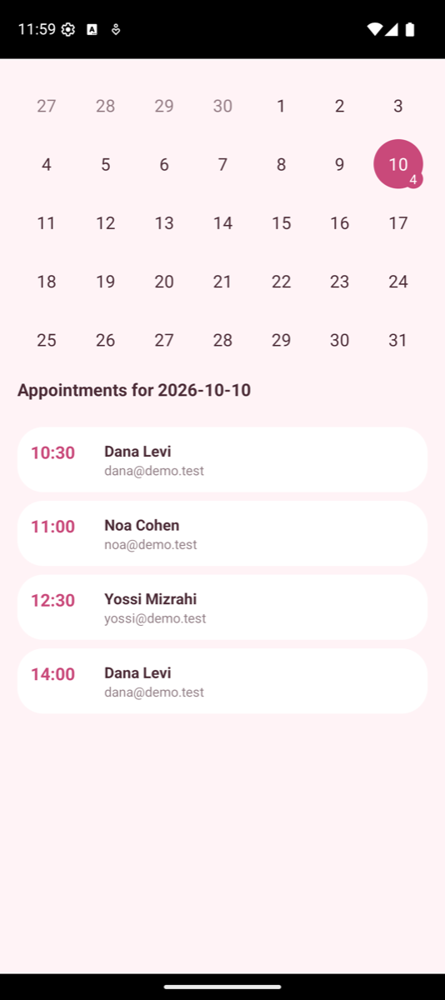

# UsersSDK

[](https://jitpack.io/#arielhalevy123/UsersSDK)

An Android library for user accounts in your app: register, login with JWT, profiles, per-user
custom fields and appointments, backed by a Spring Boot + PostgreSQL server you can use hosted or
run yourself.

**Documentation:** [arielhalevy123.github.io/UsersSDK](https://arielhalevy123.github.io/UsersSDK/)
(architecture, REST API, library reference, example apps).

## Install

### 1. Add the JitPack repository

In `settings.gradle.kts`:

```kotlin
dependencyResolutionManagement {
    repositories {
        google()
        mavenCentral()
        maven { url = uri("https://jitpack.io") }
    }
}
```

<details>
<summary>Groovy (<code>settings.gradle</code>)</summary>

```groovy
dependencyResolutionManagement {
    repositories {
        google()
        mavenCentral()
        maven { url 'https://jitpack.io' }
    }
}
```
</details>

### 2. Add the dependency

In your app module's `build.gradle.kts`:

```kotlin
dependencies {
    implementation("com.github.arielhalevy123:UsersSDK:1.0.0")
}
```

Groovy: `implementation 'com.github.arielhalevy123:UsersSDK:1.0.0'`

The library already declares the `INTERNET` permission.

### Requirements

| | |
|---|---|
| minSdk | **24** (Android 7.0) |
| Appointments API and calendar fragments | API **26+** (they use `java.time`) |
| compileSdk used to build the library | 35 |
| Java / Kotlin | Works from both; the API is plain Java |
| AndroidX | `android.useAndroidX=true` (the default for new projects) |
| Theme | Material Components / Material3 theme, for the bundled UI fragments |
| Server | A UsersSDK server reachable over **HTTPS** (see [Server](#server)) |

## Quick start

All calls are asynchronous; callbacks arrive on the main thread.

### Initialise

Once, before any other call (for example in `Application.onCreate()`):

```java
import io.github.arielhalevy123.userssdk.UsersSdk;

UsersSdk.init(context, "https://userssdk-api-production.up.railway.app/");
```

`baseUrl` comes from you, so you can point at the hosted server, a staging server or your own.
A missing trailing slash is added; an invalid URL throws `IllegalArgumentException`.
Use **https**. Android blocks plain `http` unless your app explicitly allows cleartext for that
host (fine for `http://10.0.2.2:8080/` during local development, see
[network security config](https://developer.android.com/privacy-and-security/security-config)).

Optional settings, before `init`:

```java
UsersSdk.setConfig(new SdkConfig()
        .setAppointmentMinutes(30)        // slot length used for conflict checks
        .setHttpLogging(false));          // true logs request bodies (passwords, tokens): debug only
```

### Register

```java
UsersSdk.get().register(
        "Dana Levi", "dana@example.com", "a-strong-password",
        "USER",          // or "ADMIN"
        adminId,         // Long id of the admin this user belongs to, or null
        null,            // optional initial custom fields (List<CustomFieldDTO>)
        new UsersSdk.Callback<AuthResponse>() {
            @Override public void onSuccess(AuthResponse res) {
                UserDTO me = res.getUser();   // the JWT is stored for you
            }
            @Override public void onError(Throwable error) { /* show a message */ }
        });
```

To let a new user pick their admin (for example a barber), `UsersSdk.get().listAdmins(cb)`
returns the admins, without login. Each entry has only `getId()` and `getName()`; no email or
custom fields.

### Login and logout

```java
UsersSdk.get().login("dana@example.com", "a-strong-password", new UsersSdk.Callback<AuthResponse>() {
    @Override public void onSuccess(AuthResponse res) { /* logged in */ }
    @Override public void onError(Throwable error) { /* wrong credentials or network */ }
});

UsersSdk.get().logout();   // clears the stored token
```

The token is saved on the device and sent automatically as `Authorization: Bearer ...`.

### Profile

```java
UsersSdk.get().currentUser(new UsersSdk.Callback<UserDTO>() {
    @Override public void onSuccess(UserDTO me) {
        String name = me.getName();
        String role = me.getRole();   // "USER" or "ADMIN"
    }
    @Override public void onError(Throwable error) { }
});

UserDTO me = UsersSdk.get().getCurrentUser();   // cached copy after currentUser()/updateUser()
me.setName("Dana L.");
UsersSdk.get().updateUser(me, callback);
```

Admins can list the users they manage with `UsersSdk.get().myUsers(cb)`.

### Custom fields

Any key/value data per user (phone, notes, preferences). `updateUser` saves the **whole list**, so
modify the existing list rather than sending a new one with a single field:

```java
UserDTO me = UsersSdk.get().getCurrentUser();
List<CustomFieldDTO> fields = me.getCustomFields() != null
        ? me.getCustomFields() : new ArrayList<>();
fields.add(new CustomFieldDTO("phone", "050-1234567"));
me.setCustomFields(fields);

UsersSdk.get().updateUser(me, new UsersSdk.Callback<UserDTO>() {
    @Override public void onSuccess(UserDTO updated) { }
    @Override public void onError(Throwable error) { }
});
```

### Appointments (API 26+)

Appointments are stored on the user as `"yyyy-MM-dd HH:mm"` values.

```java
UsersSdk.Appointments appts = UsersSdk.appointments();
UserDTO me = UsersSdk.get().getCurrentUser();

appts.listValues(me, cb);                                    // List<String>
appts.add(me, "2026-10-12 10:30", cb);                       // book
appts.replace(me, "2026-10-12 10:30", "2026-10-12 11:00", cb);
appts.delete(me, "2026-10-12 11:00", cb);

// Before booking: does this slot overlap anyone else's appointment with the same admin?
appts.hasConflictAgainstMyUsers("2026-10-12 10:30",
        UsersSdk.config().getAppointmentMinutes(), me.getId(), true,
        new UsersSdk.Callback<Boolean>() {
            @Override public void onSuccess(Boolean conflict) { }
            @Override public void onError(Throwable error) { }
        });
```

### Ready-made UI (API 26+)

```java
Fragment calendar = UsersSdkCalendar.newUserCalendarFragment();    // a user's appointments
Fragment adminCal = UsersSdkCalendar.newAdminCalendarFragment();   // all appointments of an admin's users
Fragment profile  = new UserProfileFragment();                      // name + custom fields editor
```

### Theming the built-in screens

The calendar, profile and add-appointment screens take their look from your app theme, so
the same SDK screens can look like a barbershop or a gel nails studio. Set any of these in
the theme your activities use; whatever you leave out falls back to your Material colours.

```xml
<style name="Theme.MyShop" parent="Theme.MaterialComponents.DayNight.NoActionBar">
    <item name="usersSdkColorPrimary">#D4A84B</item>     <!-- marked days, badges, button -->
    <item name="usersSdkColorOnPrimary">#141414</item>   <!-- text on the primary colour -->
    <item name="usersSdkColorSurface">#F5F0E8</item>     <!-- screen background -->
    <item name="usersSdkColorCard">#FFFFFF</item>        <!-- list rows -->
    <item name="usersSdkColorOnSurface">#1A1A1A</item>   <!-- text -->
    <item name="usersSdkColorMuted">#8A8A8A</item>       <!-- secondary text, other months -->
    <item name="usersSdkCornerRadius">6dp</item>
    <item name="usersSdkFontFamily">@font/my_font</item>
</style>
```

The `barberapp` sample builds twice from one codebase: `assembleBarberDebug` (black and gold,
sharp corners) and `assembleNailsDebug` (rose and blush, 24dp corners). The flavours differ
only in `src/<flavour>/res`.

## Server

The SDK needs a UsersSDK server. Two options:

**Hosted:** `https://userssdk-api-production.up.railway.app/` (live on Railway; see [RAILWAY_DEPLOY.md](RAILWAY_DEPLOY.md)). Health check: `GET /actuator/health`.

**Self-host with Docker Compose** (PostgreSQL + server):

```bash
git clone https://github.com/arielhalevy123/UsersSDK.git && cd UsersSDK
cp .env.example .env        # fill in DB_USER, DB_PASSWORD and JWT_SECRET (openssl rand -base64 32)
docker compose up -d --build
curl http://localhost:8080/actuator/health
```

The Admin Portal is at `/` and interactive API docs at `/swagger-ui.html`.
Server environment variables:

| Variable | Purpose |
|---|---|
| `JWT_SECRET` | **Required.** At least 32 bytes. |
| `DB_URL`, `DB_USER`, `DB_PASSWORD` | Datasource (`jdbc:postgresql://...`). |
| `DATABASE_URL` or `PGHOST`/`PGPORT`/`PGUSER`/`PGPASSWORD`/`PGDATABASE` | Alternative used by Railway and similar hosts; converted to a jdbc URL automatically. |
| `PORT` | HTTP port (default 8080). |
| `SEED_DEMO_DATA` | `true` (default) creates the demo accounts below. Set `false` on public servers. |
| `CORS_ALLOWED_ORIGINS` | Extra browser origins, comma-separated. |

Run without Docker: start PostgreSQL, export the variables above, then `./gradlew bootRun`.

## API overview

REST API under `/api`. Authenticated calls need `Authorization: Bearer <token>` (the SDK does
this for you).

| Method | Path | Auth | Purpose |
|--------|------|------|---------|
| POST | `/api/auth/register` | No | Register, returns JWT + user |
| POST | `/api/auth/login` | No | Login, returns JWT + user |
| GET | `/api/auth/me` | Yes | Current user |
| GET | `/api/auth/my-admin` | Yes | The current user's admin (or self, for an admin) |
| GET | `/api/auth/my-users` | Yes | Users I manage / my group |
| GET | `/api/auth/admins` | No | Admins to choose from at registration (id + name only) |
| GET | `/api/auth/all` | Admin | All users with their fields |
| GET | `/api/auth/admin/{adminId}/users` | Yes (that admin) | Users of a given admin |
| PUT | `/api/auth/users/{id}` | Yes (self or admin) | Update name, email and custom fields |
| POST | `/api/admin/users/{id}/fields` | Yes | Add a custom field |
| GET | `/api/admin/users/{id}/fields` | Yes | List custom fields |
| PUT | `/api/admin/fields/{id}` | Yes | Update a custom field |
| DELETE | `/api/admin/fields/{id}` | Yes | Delete a custom field |
| GET | `/actuator/health` | No | Health check |

Full, browsable reference: `/swagger-ui.html` on any running server.

## Developing this repository

### Backend

```bash
./gradlew test       # unit + integration tests (H2, no database needed)
./gradlew bootRun    # needs PostgreSQL and the variables above
```

### Android

From `UsersSdkAndroid/`:

```bash
./gradlew :userssdk:testDebugUnitTest          # library unit tests
./gradlew :userssdk:publishToMavenLocal        # build the AAR as JitPack does
./gradlew assembleDebug -PusersSdkBaseUrl=http://192.168.1.122:8080/   # demo apps against a LAN server
```

The demo apps read the server from `BuildConfig.USERS_SDK_BASE_URL`, set once in
`UsersSdkAndroid/build.gradle.kts` (default `https://userssdk-api-production.up.railway.app/`, override with
`-PusersSdkBaseUrl=...`). Plain `http` is allowed only for `localhost`, `10.0.2.2` and
`192.168.1.122` in their network security config. If the build fails with "SDK location not
found", create `UsersSdkAndroid/local.properties` with `sdk.dir=$HOME/Library/Android/sdk`.
See [docs/INSTALL_APP.md](docs/INSTALL_APP.md) to install a demo APK on a phone.

### Releasing a new version

1. Bump the default version in `UsersSdkAndroid/userssdk/build.gradle.kts`.
2. Tag and push: `git tag 1.0.1 && git push origin 1.0.1`.
3. Open `https://jitpack.io/#arielhalevy123/UsersSDK` and click **Get it** to trigger the build.
   The JitPack version equals the tag name exactly.

## Features

- **JWT authentication** – Stateless login/register; token stored on device and sent with requests.
- **Admin and User roles** – Admins manage users; users can be linked to an admin.
- **Custom fields** – Arbitrary key-value fields per user (e.g. phone, notes).
- **Appointments** – Stored as a custom field (`Appointment`) with semicolon-separated `yyyy-MM-dd HH:mm` values; SDK supports list/add/replace/delete and conflict detection.
- **Admin Portal (web)** – Static UI at `/` for register, login, and managing “my users” and custom fields.
- **Android SDK + demo app** – Library facade (`UsersSdk`) and sample app (login, register, profile, calendar, admin/user flows).
- **Docker** – `docker-compose` for PostgreSQL and the backend app.

## Repository layout

This repo contains both the backend and the Android project:

| Path | Description |
|------|--------------|
| **Root** | Spring Boot backend: `src/`, `build.gradle`, `Dockerfile`, `docker-compose.yml`, `ARCHITECTURE.md` |
| **UsersSdkAndroid/** | Android project: **userssdk** library module and the demo apps **app** and **barberapp** |

```
├── src/                    # Backend Java + static web (Admin Portal)
├── build.gradle
├── Dockerfile
├── docker-compose.yml
├── ARCHITECTURE.md         # Full architecture and modules
├── README.md
├── jitpack.yml             # tells JitPack to build only UsersSdkAndroid/userssdk
├── railway.json            # Railway build + health check
├── RAILWAY_DEPLOY.md       # hosting steps
└── UsersSdkAndroid/
    ├── app/                # Demo Android app
    ├── barberapp/          # Second demo app (barbershop booking)
    ├── userssdk/           # Android SDK library (published as com.github.arielhalevy123:UsersSDK)
    ├── build.gradle.kts
    └── settings.gradle.kts
```

## Diagrams

### System overview



### API / SDK flow



### Backend layers



## Screenshots

### API & Admin Portal

When the backend is running, open **http://localhost:8080/** (or your hosted URL) to use the Admin Portal: register, login, view “Users You Manage”, and edit users and their custom fields.

**Login page**


**Admin dashboard (after login)**

Log in as **admin@example.com** / **admin123** to see "Welcome, Admin" and the "Users You Manage" table.


To regenerate these screenshots (with the backend running): `node scripts/capture-admin-screenshots.js` (requires `npm install puppeteer`). Sample data includes the admin and two users (Alice Smith, Bob Jones) with custom fields and appointments.

### Android apps

The same booking app built twice from one codebase (`barberapp` flavours `barber` and `nails`).
The calendar is the SDK's own screen; only the theme differs.

| Barber Shop | | Gel Nails Studio | |
|---|---|---|---|
|  |  |  |  |

More in [docs/example-apps.md](docs/example-apps.md).

## Documentation

For full architecture, modules, data model, and security details, see **[ARCHITECTURE.md](ARCHITECTURE.md)**.

## License

MIT, see [LICENSE](LICENSE).
