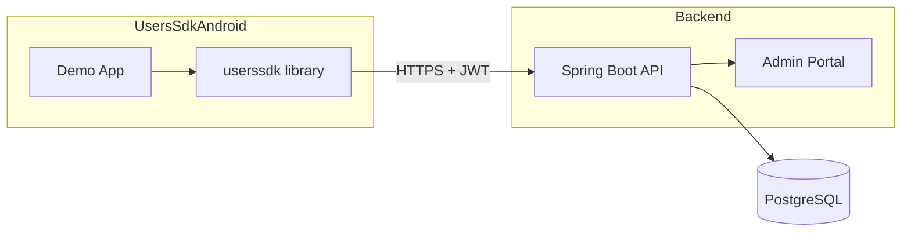
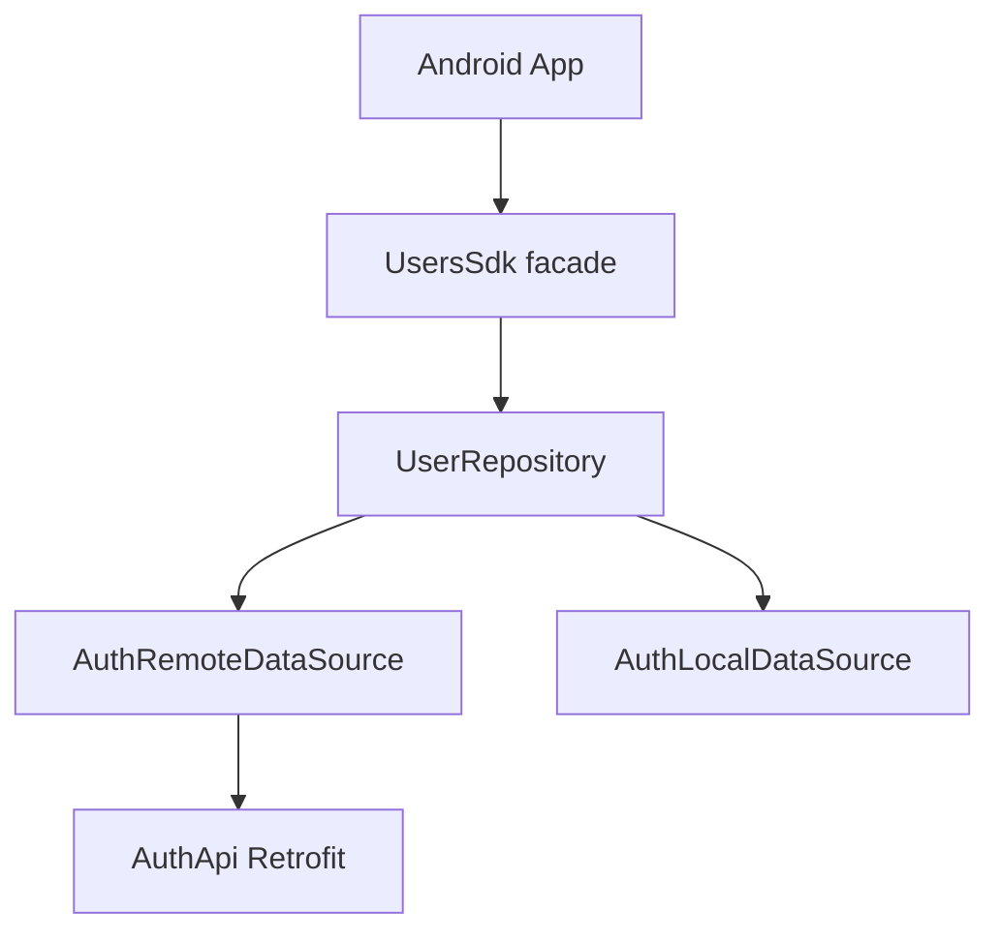
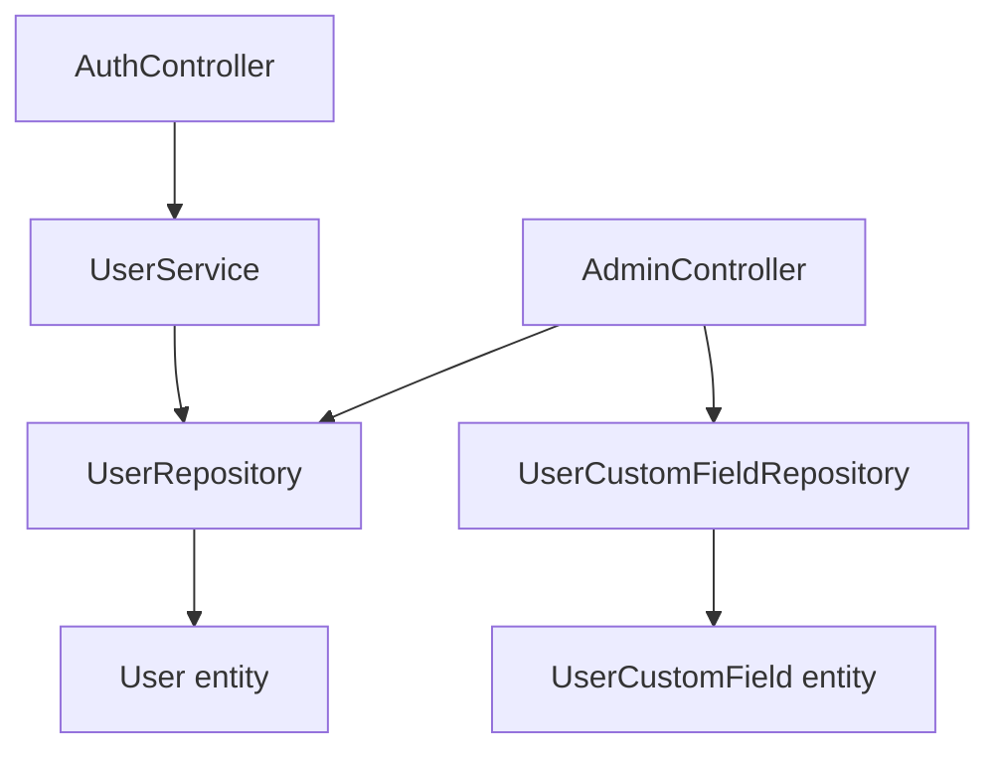
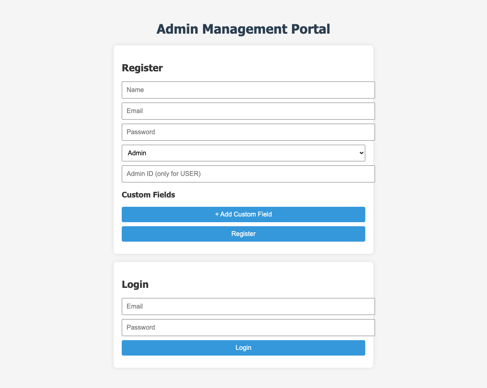
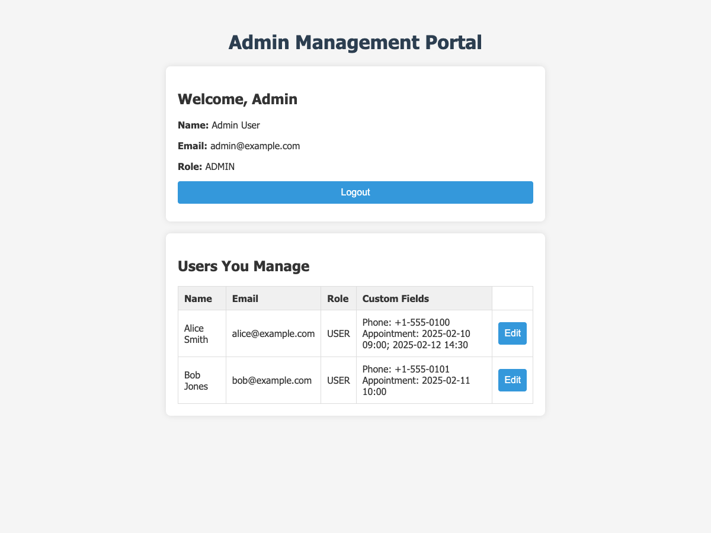
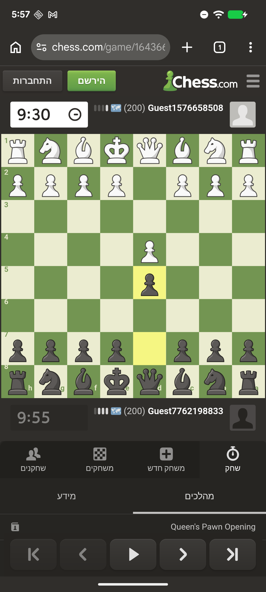

# UsersSDK

Backend API and Android SDK for user and authentication management with an admin–user hierarchy, custom fields, and appointments. The backend is a Spring Boot REST API with JWT auth; the Android app uses an embeddable SDK that talks to the same API.

## Features

- **JWT authentication** – Stateless login/register; token stored on device and sent with requests.
- **Admin and User roles** – Admins manage users; users can be linked to an admin.
- **Custom fields** – Arbitrary key-value fields per user (e.g. phone, notes).
- **Appointments** – Stored as a custom field (`Appointment`) with semicolon-separated `yyyy-MM-dd HH:mm` values; SDK supports list/add/replace/delete and conflict detection.
- **Admin Portal (web)** – Static UI at `/` for register, login, and managing “my users” and custom fields.
- **Android SDK + demo app** – Library facade (`UsersSdk`) and sample app (login, register, profile, calendar, admin/user flows).
- **Docker** – `docker-compose` for PostgreSQL and the backend app.

## Repository layout

This repo contains both the backend and the Android project:

| Path | Description |
|------|--------------|
| **Root** | Spring Boot backend: `src/`, `build.gradle`, `Dockerfile`, `docker-compose.yml`, `ARCHITECTURE.md` |
| **UsersSdkAndroid/** | Android project: demo **app** and **userssdk** library module |

```
├── src/                    # Backend Java + static web (Admin Portal)
├── build.gradle
├── Dockerfile
├── docker-compose.yml
├── ARCHITECTURE.md         # Full architecture and modules
├── README.md
└── UsersSdkAndroid/
    ├── app/                # Demo Android app
    ├── userssdk/            # Android SDK library
    ├── build.gradle.kts
    └── settings.gradle.kts
```

## Diagrams

### System overview



### API / SDK flow



### Backend layers



## Screenshots

### API & Admin Portal

When the backend is running, open **http://localhost:8080/** to use the Admin Portal: register, login, view “Users You Manage”, and edit users and their custom fields.

**Login page**



**Admin dashboard (after login)**

Log in as **admin@example.com** / **admin123** to see "Welcome, Admin" and the "Users You Manage" table.



To regenerate these screenshots (with the backend running): `node scripts/capture-admin-screenshots.js` (requires `npm install puppeteer`). Sample data includes the admin and two users (Alice Smith, Bob Jones) with custom fields and appointments.

### Android app

Screenshots below were captured from a connected Android device. The app starts at a main screen with Register and Login; after login, admins see the admin appointments flow and users see the user flow (appointments, profile, calendar).

| Main screen | Login | Profile |
|-------------|-------|---------|
|  |  |  |

**How to capture these screens:** Open the app on your phone, then for each screen run the command below (from the project root). See [docs/ANDROID_SCREENSHOTS.md](docs/ANDROID_SCREENSHOTS.md) for full steps.

```bash
# 1. Show main screen (Register/Login) on phone, then:
adb exec-out screencap -p > docs/screenshots/app-main.png

# 2. Tap Login on phone, then:
adb exec-out screencap -p > docs/screenshots/app-login.png

# 3. Log in, open Profile on phone, then:
adb exec-out screencap -p > docs/screenshots/app-profile.png
```

Use your Android SDK `adb` (e.g. `$HOME/Library/Android/sdk/platform-tools/adb`) if `adb` is not in your PATH.

## API overview

REST API with base paths `/api/auth` and `/api/admin`. Send the JWT in the header: `Authorization: Bearer <token>`.

| Method | Path | Purpose |
|--------|------|---------|
| POST | `/api/auth/register` | Register |
| POST | `/api/auth/login` | Login (returns JWT + user) |
| GET | `/api/auth/me` | Current user |
| GET | `/api/auth/my-users` | Users I manage / my group |
| PUT | `/api/auth/users/{id}` | Update user |
| POST | `/api/admin/users/{id}/fields` | Add custom field |
| GET | `/api/admin/users/{id}/fields` | List custom fields |
| PUT | `/api/admin/fields/{id}` | Update custom field |
| DELETE | `/api/admin/fields/{id}` | Delete custom field |

## Getting started

### Backend

1. Clone the repo.
2. Start PostgreSQL (e.g. `docker-compose up -d postgres`).
3. Configure `src/main/resources/application.properties` (or env): `spring.datasource.url`, `spring.datasource.username`, `spring.datasource.password`, `app.jwt.secret`.
4. Run: `./gradlew bootRun`. The API and Admin Portal are at **http://localhost:8080**.

To run with Docker: `docker-compose up -d` (builds and runs the app container after Postgres).

### Android

1. **Install the app** – See **[docs/INSTALL_APP.md](docs/INSTALL_APP.md)** for building the APK and installing via USB (adb), copying the APK to your phone, or running from Android Studio.
2. **First-time build:** From `UsersSdkAndroid/`, run `./gradlew assembleDebug`. If the build fails with "SDK location not found", add `local.properties` with `sdk.dir=` your Android SDK path (e.g. `echo "sdk.dir=$HOME/Library/Android/sdk" > local.properties`).
3. Set the backend URL in **MainActivity** (e.g. `UsersSdk.init(this, "http://YOUR_IP:8080/");`) and run on an emulator or device.

## Documentation

For full architecture, modules, data model, and security details, see **[ARCHITECTURE.md](ARCHITECTURE.md)**.
