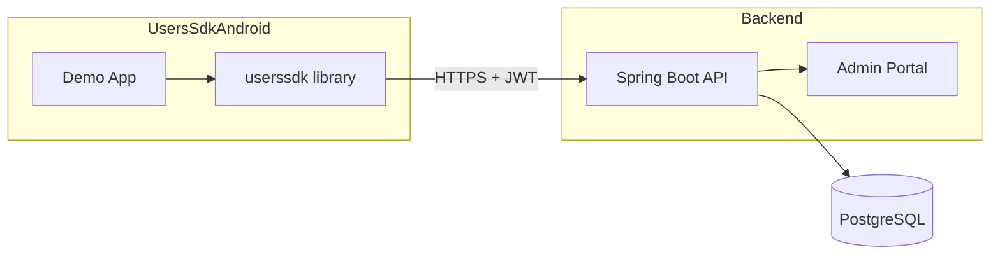
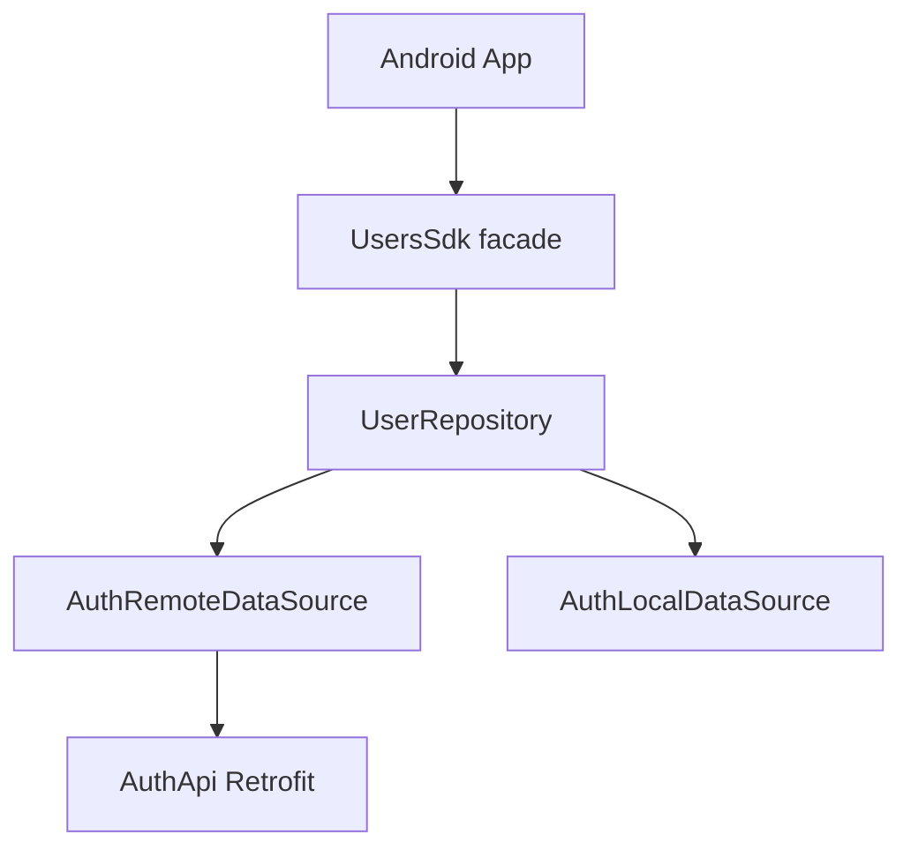
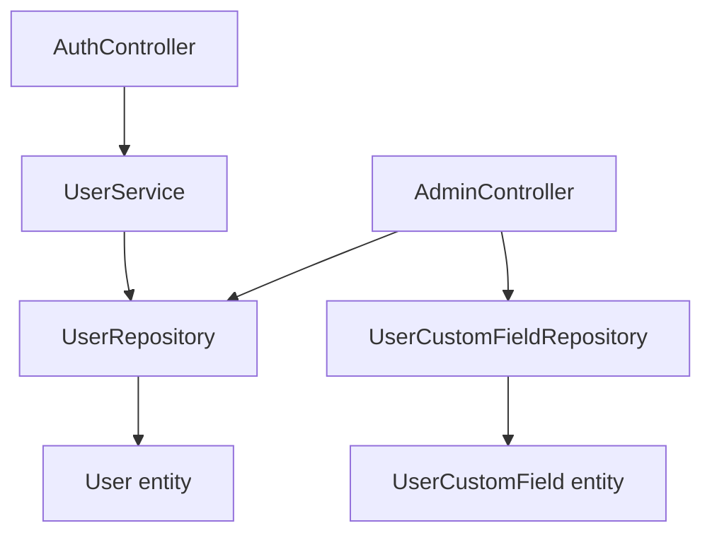

# Architecture

[← Documentation home](index.md)

The app only talks to the library. The library calls the REST API over HTTPS with a JWT; the API
keeps users, custom fields and appointments in PostgreSQL and also serves the admin portal.

### System overview

### API / SDK flow

### Backend layers

## Request path, step by step

1. The app calls a method on `UsersSdk` (for example `login`).
2. The repository sends the request through Retrofit; the stored token is attached as
   `Authorization: Bearer …`.
3. `AuthController` or `AdminController` checks the token and the role (admin routes need
   `ROLE_ADMIN`; a user only sees themself, an admin only their own users).
4. The service reads or writes PostgreSQL through Spring Data repositories.
5. The answer comes back to the app's callback on the main thread.

## Data model

| Entity | Holds |
|--------|-------|
| `User` | name, email, BCrypt password hash, role (`USER` or `ADMIN`), the admin it belongs to |
| `UserCustomField` | one key and value per row, linked to a user; appointments are the `Appointment` field with `yyyy-MM-dd HH:mm` values |

See also [ARCHITECTURE.md](https://github.com/arielhalevy123/UsersSDK/blob/main/ARCHITECTURE.md) for every module.
