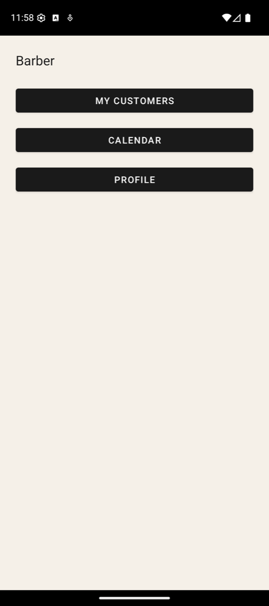
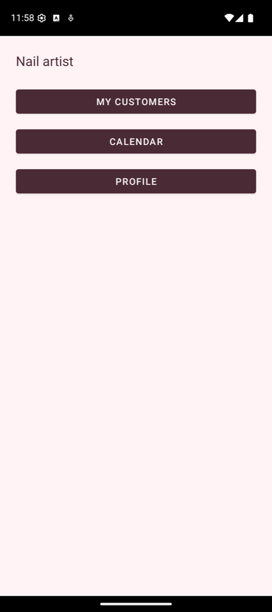
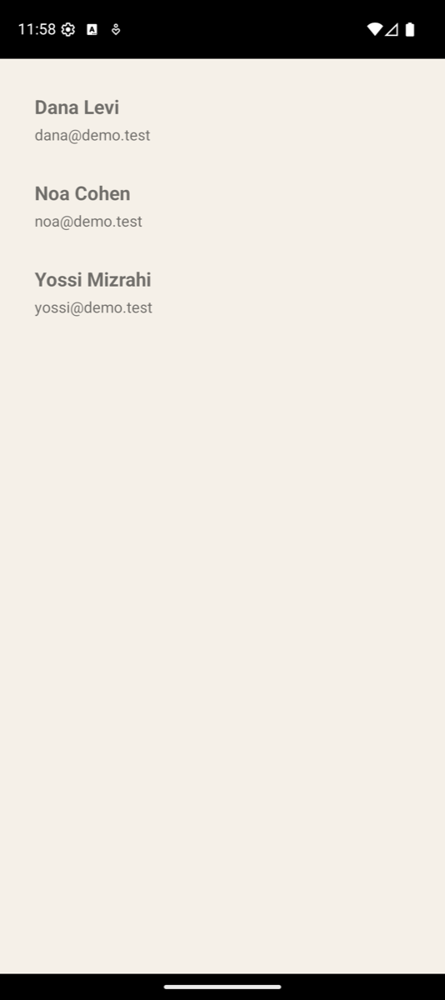
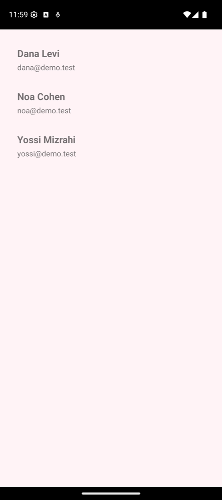

# Example apps

[← Documentation home](index.md)

Two Android apps in `UsersSdkAndroid/` use the library the way a developer would.

## barberapp: one codebase, two businesses

A booking app for a small business, built twice from the same code with Gradle product flavours.
The flavours differ only in `src/<flavour>/res` (colours, corner radius, wording); the SDK's
built-in calendar follows through the `usersSdk*` theme attributes.

| | Barber Shop (`barber`) | Gel Nails Studio (`nails`) |
|---|---|---|
| Welcome |  |  |
| Owner home |  |  |
| SDK calendar (a day with 4 bookings) |  |  |
| Customers |  |  |

The calendar, the booked-day badge and the appointment rows are the SDK's own screen
(`UsersSdkCalendar.newAdminCalendarFragment()`); only the theme changes between the two apps.

### What it shows

- A customer registers under a business owner (`listAdmins`, `register`), logs in and books,
  moves or cancels an appointment; the SDK checks the slot against every other customer of the
  same owner (`hasConflictAgainstMyUsers`).
- The owner logs in as an admin, sees their customers (`myUsers`) and the calendar of all their
  bookings, and can add an appointment for a customer (`UsersSdkAddAppointmentFab`).

### Build and run

From `UsersSdkAndroid/`:

```bash
./gradlew :barberapp:assembleBarberDebug   # Barber Shop
./gradlew :barberapp:assembleNailsDebug    # Gel Nails Studio (installs next to the barber app)
```

Both talk to the hosted server by default. To use a server on your computer:
`-PusersSdkBaseUrl=http://localhost:8080/` and `adb reverse tcp:8080 tcp:8080`.
Ready-built APKs are attached to every [GitHub Release](https://github.com/arielhalevy123/UsersSDK/releases)
and to every CI run. See [Install a demo APK](INSTALL_APP.md).

## app: the demo of every call

`UsersSdkAndroid/app` walks through each library call on its own screen: register, login,
profile with custom fields, the user calendar and the admin calendar.

```bash
./gradlew :app:assembleDebug
```

The screenshots on this page were taken on the Pixel 9 emulator against a local server
(`docker compose up`) seeded with one owner and three customers.
